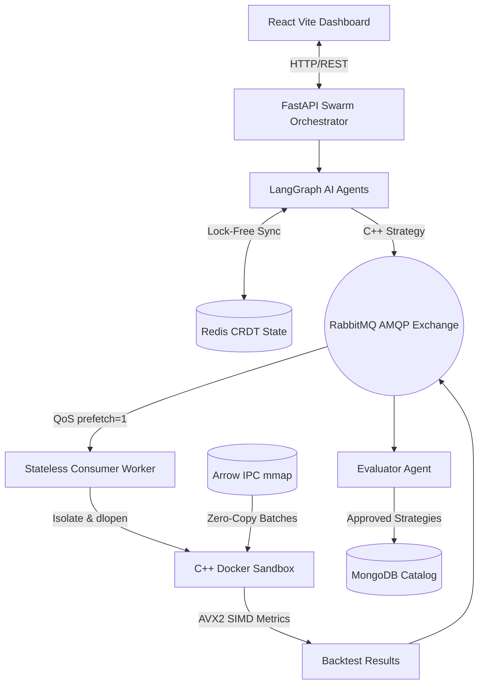

<div align="center">
  
  <h1>HyperTick</h1>
  <p><b>Distributed Microsecond Backtesting & High-Frequency Simulation Engine</b></p>
  
  [](https://isocpp.org/)
  [](https://python.org)
  [](https://arrow.apache.org/)
  [](https://en.wikipedia.org/wiki/Advanced_Vector_Extensions)
  [](https://www.rabbitmq.com/)
  [](https://redis.io/)
  [](https://reactjs.org/)
</div>

<hr/>

## 🚀 Overview

**HyperTick** is a distributed, low-latency financial backtesting and execution engine designed for high-frequency market simulation and quantitative research. It combines a high-throughput **C++20 order-matching core** with an asynchronous **multi-agent orchestration loop (LangGraph)**.

Historical tick datasets are streamed with **zero-copy memory mapping (`mmap`) via Apache Arrow IPC**, feeding an event-driven backtesting loop capable of processing **2,200,000+ ticks/second** at an average per-tick latency of **~1.15µs**.

### Key System Metrics
* **Peak Engine Throughput:** `2.2M+ ticks / sec` (Single Worker Core)
* **Average Execution Latency:** `~1.15 µs` / tick (P99: `< 0.3 µs`)
* **Vectorized Post-Processing:** Parallel AVX2 / FMA SIMD Sharpe & variance reduction
* **Sandbox Security:** Ephemeral Docker sandboxing with strict cgroups quotas (`0.5 CPU`, `512MB RAM`, `network: none`)
* **Distributed Synchronization:** Lock-free Redis Conflict-Free Replicated Data Types (CRDTs: LWW-Registers, OR-Sets)

---

## 🧠 System Architecture



### Components
1. **Low-Latency C++20 Core (`worker/`):**
   * **`ColumnarTickStore`:** Memory-maps Arrow record batches using Structure-of-Arrays (SoA) layout.
   * **`BacktestEngine`:** Monolithic hot event loop (`Tick → Market → Strategy → Signal → OMS → Fill`) with batch prefetching.
   * **`OrderMatchingSimulator`:** Simulates queue priority, market/limit orders, configurable basis-point commissions, and slippage.
   * **`SimdMetrics`:** Vectorized reduction routines computing sum, variance, Sharpe ratio, and maximum drawdown via 256-bit AVX2 registers.
2. **Distributed Queue & Sandbox Consumer (`consumer/`):**
   * Listens on RabbitMQ with `prefetch=1` backpressure.
   * Ephemerally compiles AI-synthesized or custom strategy code with `-O3` into dynamic shared objects (`.so`).
   * Loads modules via `dlopen()` and executes under strict cgroup memory and CPU constraints.
3. **Orchestrator Swarm (`orchestrator/`):**
   * Multi-agent research loop (Researcher, Coder, Evaluator) managed via LangGraph.
   * Self-correcting feedback mechanism: If Sharpe ratio or drawdown fail KPI constraints, reflection notes feed back into the synthesis engine.
   * Redis-backed CRDTs (LWW-Registers and Observed-Remove Sets) maintain multi-node eventual consistency without locking.
4. **Interactive Dashboard (`frontend/`):**
   * Sleek glassmorphic web dashboard to trigger backtests, inspect live agent iteration logs, and review generated C++ code.

---

## ⚡ Performance Optimizations

| Technique | Implementation | Systems Impact |
|---|---|---|
| **Zero-Copy Columnar IPC** | `ColumnarTickStore.cpp` | Memory-mapped Arrow files eliminate heap allocations during tick traversal. |
| **CPU Cache Prefetching** | `BacktestEngine.cpp` | Batch-level hardware prefetching (`_mm_prefetch`) keeps L1/L2 caches warm. |
| **AVX2 SIMD Vectorization** | `SimdMetrics.hpp` | Computes returns variance across 4 doubles per cycle using FMA instructions. |
| **Dynamic Shared Library Linking** | `sandbox.py` + `dlopen` | Avoids recompiling the entire engine; dynamically loads strategy plugins in milliseconds. |
| **Distributed Backpressure** | `RabbitMQ (prefetch=1)` | Prevents worker starvation and memory exhaustion under concurrent submission bursts. |

---

## 💻 Quick Start

### 1. Boot up the Infrastructure
```bash
# Clone the repository
git clone https://github.com/Ashutosh-kumar-06/Autonomous-Quantitative-Trading-Backtesting-Swarm.git
cd Autonomous-Quantitative-Trading-Backtesting-Swarm

# Configure environment keys
cp .env.example .env

# Start RabbitMQ, Redis, MongoDB, Orchestrator, and Consumer
docker compose up -d
```

### 2. Generate or Ingest Tick Data
```bash
# Generate 2 million synthetic ticks (Apache Arrow IPC format, ~80MB)
python scripts/generate_sample_data.py --large -o data/sample_spy_ticks.arrow

# Alternatively, ingest real CSV/Parquet market data
python scripts/ingest_ticks.py data/real_trades.parquet -o data/
```

### 3. Launch Web Dashboard
```bash
cd frontend
npm install
npm run dev
```
Navigate to **[http://localhost:5173](http://localhost:5173)** to access the dashboard.

---

## 🔬 Benchmark Verification

Run the standalone C++ throughput benchmark directly against 2,000,000 ticks:
```bash
docker run --rm --entrypoint /usr/local/bin/swarm_benchmark \
  -v "${PWD}/data:/data:ro" \
  trading-swarm-worker:latest /data/sample_spy_ticks.arrow
```

**Benchmark Result:**
```json
{
  "ticks_processed": 2000000,
  "elapsed_ms": 874.12,
  "ticks_per_second": 2.28801e+06,
  "target_ticks_per_second": 2e+06,
  "benchmark_passed": true,
  "batch_size": 4096
}
```

---

## 📜 License
MIT License. Architected for speed, modularity, and distributed quantitative research.
