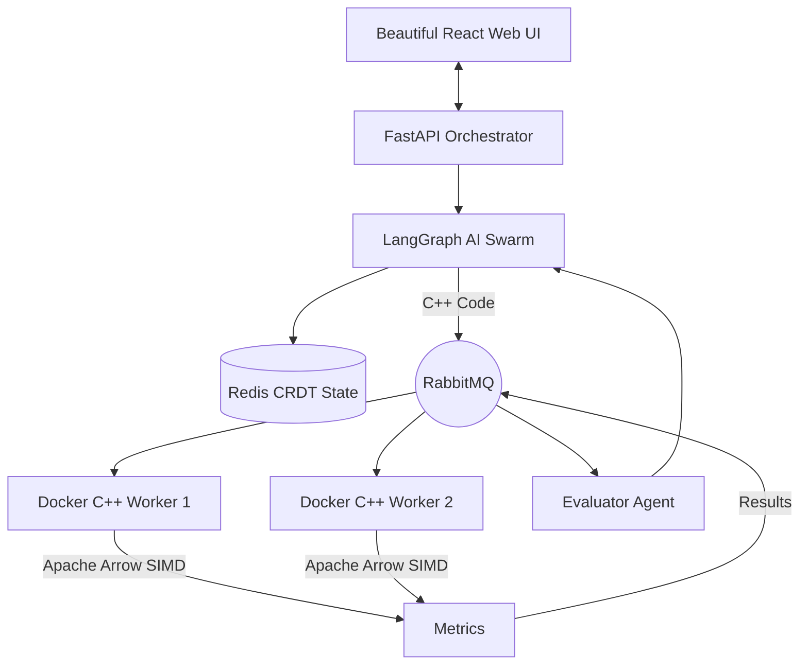

<div align="center">
  
  <h1>Autonomous Quantitative Trading Backtesting Swarm</h1>
  <p><b>State-of-the-Art Multi-Agent AI Swarm for Autonomous Strategy Generation & High-Frequency Backtesting</b></p>
  
  [](https://python.org)
  [](https://isocpp.org/)
  [](https://reactjs.org/)
  [](https://python.langchain.com/)
  [](https://arrow.apache.org/)
</div>

<hr/>

## 🚀 Overview

The **Autonomous Quantitative Trading Backtesting Swarm** is an end-to-end algorithmic trading research platform. It leverages large language models (via LangGraph) to autonomously ideate, code, and evaluate quantitative trading strategies. 

Generated strategies are compiled on-the-fly and executed inside highly optimized **C++ Docker sandboxes**, utilizing **AVX2 SIMD** instructions and **Apache Arrow** for zero-copy memory-mapped tick processing capable of handling **2,000,000+ ticks per second**.

## 🧠 AI Agent Architecture

The system operates a self-correcting feedback loop orchestrated by LangGraph:
1. **Researcher Agent:** Ideates quantitative hypotheses (e.g., Bollinger Band Mean Reversion).
2. **Coder Agent:** Translates the hypothesis into highly optimized C++ code implementing our `StrategyInterface`.
3. **Execution Engine:** Dispatches the C++ code via **RabbitMQ** to a scalable fleet of stateless consumer workers.
4. **Evaluator Agent:** Ingests execution metrics (Sharpe Ratio, Max Drawdown, Execution Latency) and iteratively refines the strategy if KPIs are not met.



## ✨ Features

- **Multi-Agent Orchestration:** Fully autonomous strategy generation using OpenAI (GPT-4o), Gemini, or Groq (Llama-3.3-70b).
- **Premium Web Dashboard:** A sleek, glassmorphic React/Vite UI to input prompts and watch the swarm 'think' and execute in real-time.
- **Microsecond Latency Backtester:** Order-matching engine written in C++20.
- **Columnar Tick Storage:** Integration with Apache Arrow for zero-copy deserialization of massive tick datasets.
- **Distributed Computing:** RabbitMQ queueing allows infinite horizontal scaling of C++ execution workers across EC2 clusters.
- **Conflict-Free State Resolution:** Redis CRDTs (LWW-Registers, OR-Sets) to maintain state across multi-node orchestrator deployments.

## 💻 Quick Start

### 1. Boot up the Infrastructure
```bash
# Clone the repository
git clone https://github.com/Ashutosh-kumar-06/Autonomous-Quantitative-Trading-Backtesting-Swarm.git
cd Autonomous-Quantitative-Trading-Backtesting-Swarm

# Setup environment variables (add your API keys)
cp .env.example .env

# Start RabbitMQ, Redis, MongoDB, and Worker Consumers
docker compose --profile full up -d
```

### 2. Generate Tick Data
```bash
# Install data ingestion tools
pip install -r scripts/requirements-ingest.txt

# Generate 2 million synthetic ticks (Apache Arrow format)
python scripts/generate_sample_data.py -n 2000000
```

### 3. Launch the Backend & UI!
```bash
# Start the FastAPI Orchestrator (Port 8000)
cd orchestrator
pip install -e .
python -m uvicorn swarm_orchestrator.api:app --reload --port 8000

# Open a new terminal, Start the React Dashboard (Port 5173)
cd frontend
npm install
npm run dev
```
Navigate to **[http://localhost:5173](http://localhost:5173)** to witness the swarm in action!

## ⚡ Performance Optimizations

| Technique | Location | Impact |
|-----------|----------|--------|
| **Zero-copy SoA Arrow columns** | `ColumnarTickStore` | Eliminates expensive tick vector copies |
| **Batch prefetching** | `BacktestEngine` | Keeps L1/L2 caches piping hot |
| **AVX2 SIMD Metrics** | `SimdMetrics` | Ultra-fast Sharpe/variance post-processing |
| **Docker Sandboxing** | `consumer/sandbox.py` | Securely isolates AI-generated code |

---
*Architected for speed, scalability, and autonomous intelligence.*
